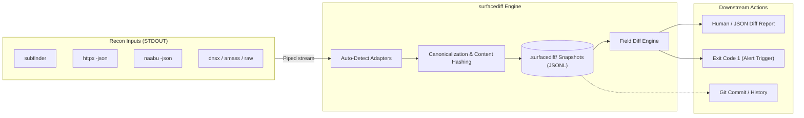

<div align="center">

# surfacediff

### External Attack Surface Snapshotting & Deterministic Field Diffs

[](https://github.com/leviathan-offsec/surfacediff)
[-emerald?style=for-the-badge)](https://github.com/leviathan-offsec/surfacediff)
[](./LICENSE)
[](https://github.com/leviathan-offsec)
[](https://leviathan.ac)

<p align="center">
  <b>Recon tools find assets. <code>surfacediff</code> turns recon into automated, continuous perimeter monitoring.</b>
</p>

</div>

---

## Why surfacediff?

ProjectDiscovery and modern recon frameworks give you outstanding scanners — `subfinder`, `httpx`, `naabu`, `dnsx`. But they all lack the crucial layer: **state over time**.

`surfacediff` is the missing bridge:
* **Pipe any recon tool straight in:** Automatically detects JSON and text streams from `subfinder`, `httpx`, `naabu`, and raw URL lists.
* **Immutable, content-addressed snapshots:** Stored as deterministic, sorted JSONL in `./.surfacediff/`. 100% git-diffable.
* **Granular field-by-field diffing:** Detects not just new/dead hosts, but status code flips (`200 -> 403`), title updates, added tech tags, and newly exposed ports.
* **Alerting by design:** `surfacediff diff` exits with **code 1 when changes are detected** — instant exit-code alerting for cron jobs, CI/CD, and bash pipelines.
* **Zero dependencies:** Built strictly with the Python standard library. No fragile dependency trees, no bloatware, zero supply-chain risk.

---

## Architecture & Pipeline Flow



---

## Quickstart

### Installation

```bash
# Direct install from GitHub
pip install git+https://github.com/leviathan-offsec/surfacediff.git

# Or clone and install editable
git clone https://github.com/leviathan-offsec/surfacediff.git
cd surfacediff && pip install -e .
```

### 1. Snapshot your live attack surface

```bash
# Capture subdomains
subfinder -d example.com -silent | surfacediff snap -l subs --source subfinder

# Capture full HTTP web assets (status, title, technology headers)
httpx -l subs.txt -json -silent | surfacediff snap -l web --source httpx

# Capture open ports
naabu -host example.com -json -silent | surfacediff snap -l ports --source naabu
```

### 2. Diff against your baseline

```bash
# Diff the last two snapshots
surfacediff diff -l web
```

**Terminal output:**
```text
label web: +1 -0 ~2
20260928T120000Z.jsonl -> 20260929T120000Z.jsonl
  + url|https://internal-dev.example.com
  ~ url|https://admin.example.com
      status_code: 403 -> 200
      title: "Forbidden" -> "Dashboard Login"
  ~ url|https://api.example.com
      tech: added [FastAPI, Swagger UI]
```

### 3. Inspect history

```bash
surfacediff show -l web
```

---

## Input Adapters (Zero Configuration)

`surfacediff` parses line-delimited streams automatically:

| Tool / Format | Auto-Detected Record | Tracked Attributes |
|---|---|---|
| `subfinder`, `dnsx`, `amass` | `host` | FQDN, root domain |
| `httpx -json` | `url` | URL, status code, title, webserver, tech stack, CDN, ASN |
| `naabu -json` | `port` | IP/Host, port number, protocol |
| Raw URLs (`https://...`) | `url` | Canonicalized URLs (stripped fragments, default ports normalized) |

---

## Automated Cron & Alerting Workflows

Because `surfacediff diff` exits with code **1** on changes and code **0** when nothing changed, continuous monitoring is a 1-liner:

### Nightly Bash Cron Job

```bash
#!/usr/bin/env bash
# Runs at midnight: snap, diff, and notify only on genuine delta
subfinder -d target.com -silent | surfacediff snap -l target-subs --source subfinder

if ! surfacediff diff -l target-subs --json > /tmp/delta.json; then
    # Surface changed! Send alert
    curl -X POST -H "Content-Type: application/json" \
         -d @/tmp/delta.json \
         "$SLACK_OR_DISCORD_WEBHOOK_URL"
fi
```

### GitHub Actions Scheduled Watcher (`.github/workflows/surface-watch.yml`)

```yaml
name: Nightly Attack Surface Delta
on:
  schedule:
    - cron: '0 0 * * *'
  workflow_dispatch:

jobs:
  recon-diff:
    runs-on: ubuntu-latest
    steps:
      - uses: actions/checkout@v4
      - uses: actions/setup-python@v5
        with:
          python-version: '3.11'

      - name: Install Tools
        run: |
          go install -v github.com/projectdiscovery/subfinder/v2/cmd/subfinder@latest
          pip install git+https://github.com/leviathan-offsec/surfacediff.git

      - name: Snapshot & Diff
        run: |
          subfinder -d example.com -silent | surfacediff snap -l prod-subs
          surfacediff diff -l prod-subs || echo "CHANGES_DETECTED=true" >> $GITHUB_ENV

      - name: Commit Updated Snapshot State
        run: |
          git config user.name "github-actions[bot]"
          git config user.email "github-actions[bot]@users.noreply.github.com"
          git add .surfacediff/
          git commit -m "chore(surface): update snapshots [skip ci]" || exit 0
          git push
```

---

## Command Reference

```text
surfacediff [OPTIONS] COMMAND [ARGS]...

Commands:
  snap   Capture a snapshot from stdin or file and update 'current'
  diff   Diff the two most recent snapshots (or between specific refs)
  show   Display snapshot history, timestamps, and record counts

Global Options:
  --dir TEXT      Directory for snapshot storage [default: ./.surfacediff]
  --version       Show version and exit
  --help          Show this message and exit
```

### `surfacediff snap` Options
* `-l, --label TEXT` **(Required)** Logical category (e.g., `prod-web`, `api-hosts`, `corp-dns`).
* `-i, --input PATH` Path to input file (defaults to STDIN).
* `--source TEXT` Optional source tag (e.g., `httpx`, `subfinder`, `naabu`).
* `--tag KEY=VALUE` Custom key-value metadata tags.

### `surfacediff diff` Options
* `-l, --label TEXT` **(Required)** Label to diff.
* `--from REF` Compare against a specific snapshot timestamp rather than the immediate predecessor.
* `--json` Emit structured JSON for machine parsing / webhook feeds.

---

## The Leviathan Ecosystem

`surfacediff` is part of the **Leviathan Offensive Tooling Suite**:

* **[surfacediff](https://github.com/leviathan-offsec/surfacediff)** - Immutable content-addressed snapshotting and perimeter delta diffing.
* **[HostageLVX](https://github.com/leviathan-offsec/HostageLVX)** - High-speed dangling DNS and subdomain takeover engine in Go.
* **[FenrirLVX](https://github.com/leviathan-offsec/FenrirLVX)** - High-speed Go CLI for WordPress/CMS auditing & offline CVE correlation.
* **[leviathan-core](https://github.com/leviathan-offsec/leviathan-core)** - Contract-enforced vulnerability risk scoring kernel (CVSS/EPSS/KEV).
* **[agy-mcp](https://github.com/leviathan-offsec/agy-mcp)** - Hardened Model Context Protocol (FastMCP) server for AI coding assistants.

---

## License

Licensed under the **MIT License**. Created & maintained by [@cyeezy08](https://github.com/cyeezy08) for [Leviathan OffSec](https://leviathan.ac).
